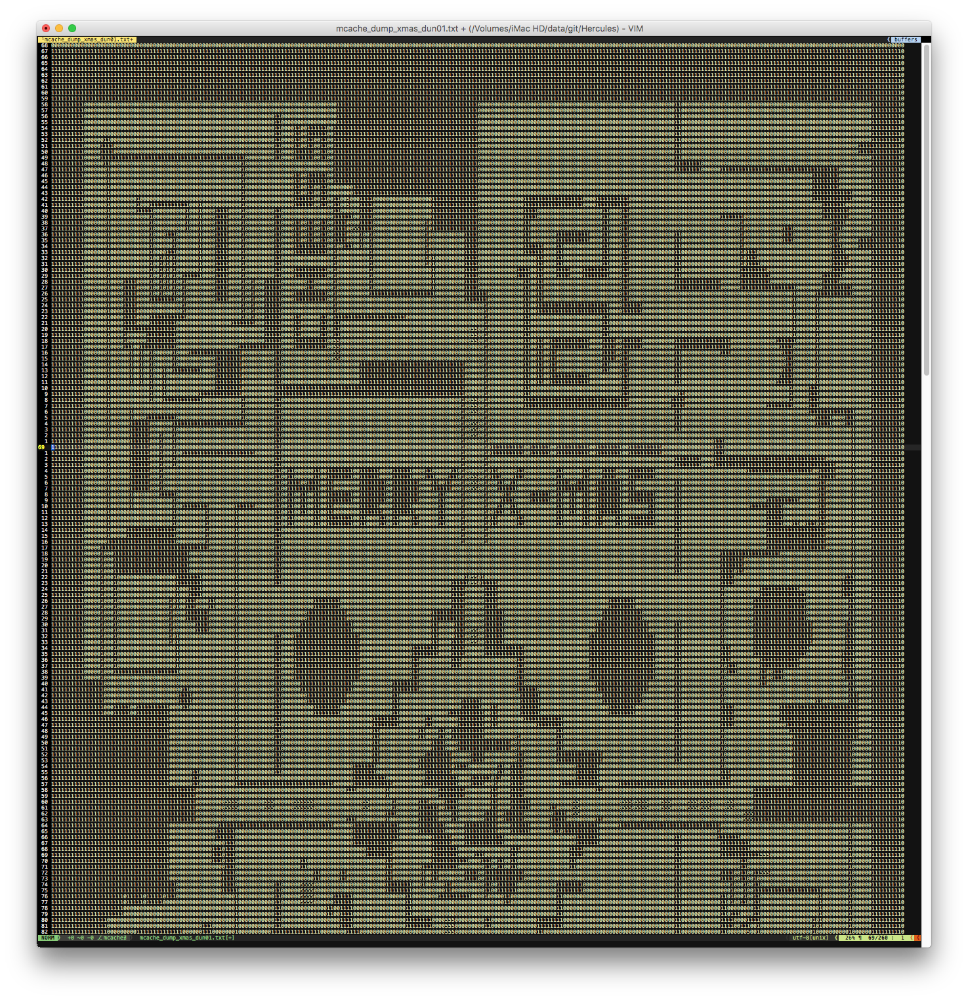

Hercules plugin: mapcache2txt
=============================

by @MishimaHaruna (Haru)

* * *

Dumps mapcache files to a textual format for visual inspection.

Purpose
-------

The purpose of this plugin is to allow visual inspection (or comparison, i.e.
after an update in the repository) or machine parsing of the binary .mcache
files, by dumping them to a text-based format.

While not currently implemented in this plugin, it would be fairly to extend it
with the inverse conversion (from `.txt`, `.json` or `.libconfig` back into
`.mcache`), effectively allowing an user to make small edits to a map's cells
information.

Configuration
-------------

The output file format is configurable by commenting out one of the three options:

- `DUMP_FORMAT_TXT`: textual, compact file format (mostly useful for visual inspection).
- `DUMP_FORMAT_JSON`: JSON file, machine-readable.
- `DUMP_FORMAT_LIBCONFIG`: libconfig file, machine-readable.

Command line options
--------------------

The plugin supports the following command line options:

- `--dump-map`: Dumps the data from a loaded map (by map name) to file. The output file will be named `mcache_dump_<map_name>.<file type>`
- `--dump-mcache`: Dumps the data from a `.mcache` file (by file name) to file. The output file will be named `mcache_dump_<map_name>.<file type>`
- `--dump-mcache`: Dumps the data from all the loaded maps to file. The output file will be named `mcache_dump_all.<file type>`

How to run it
-------------

- Compile this plugin
- Start your Map Server, passing one of the above described flags on the command line. Examples:
  - `./map-server --load-plugin mapcache2txt --dump-map prontera`
  - `./map-server --load-plugin mapcache2txt --dump-map prontera --dump-map geffen`
  - `./map-server --load-plugin mapcache2txt --dump-mcache maps/re/prontera.mcache`
  - `./map-server --load-plugin mapcache2txt --dump-mcache maps/pre-re/prontera.mcache --dump-mcache maps/re/aldebaran.mcache`
  - `./map-server --load-plugin mapcache2txt --dump-all`
- You'll find the generated files in the current folder.

Screenshots
-----------

### Example of the `.txt` output

* * *

- How to Install a Plugin: [Building a Plugin](http://herc.ws/wiki/HPM#Building_a_plugin)

