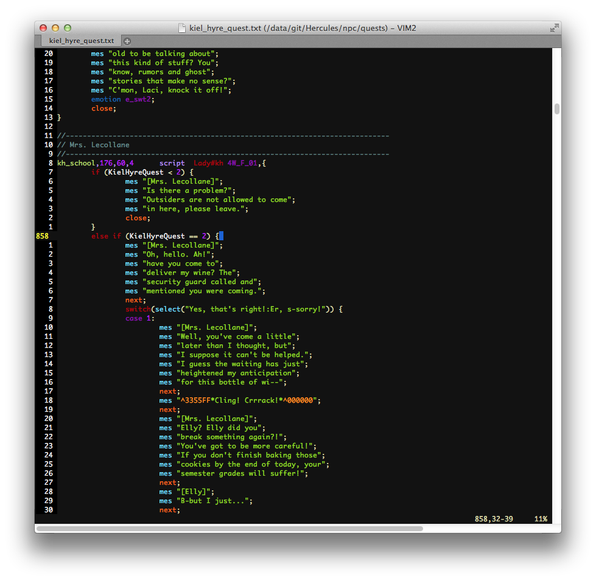

Hercules plugin: vimsyntaxgen
=============================

by @MishimaHaruna (Haru)

* * *

Generates a syntax highlighter definition script for the Hercules scripting
language, to be used with the vi/vim/gvim/MacVim text editor.

Purpose
-------

The purpose of this plugin is to automatically generate syntax definition files
whenever there's an update in Hercules (or when using custom script commands.)

It was written targeting [Vim](http://www.vim.org/) (my preferred text editor),
but feel free to use it as the base to write a syntax highlighter definition
generator for your favorite editor.

How to run it
-------------

- Compile and enable this plugin
- Run `./map-server --vimsyntaxgen`
- You'll find the generated files in the `vimsyntax` folder.

Where to put the generated files
--------------------------------

```
|_ vimsyntax
  |_ ftdetect
  | |_ herc.vim   # File type detection:      ~/.vim/ftdetect/herc.vim
  |_ ftplugin
  | |_ herc.vim   # File type plugin:         ~/.vim/ftplugin/herc.vim
  |_ indent
  | |_ herc.vim   # Indentation definition:   ~/.vim/indent/herc.vim
  |_ syntastic
  | |_ herc.vim   # Syntastic syntax checker: ~/.vim/bundle/syntastic/syntax_checkers/herc/herc.vim
  |_ syntax
    |_ herc.vim   # Syntax definition:        ~/.vim/syntax/herc.vim
```

The syntastic syntax checker plugin is optional, and in order to use it, it is
necessary to install the [Syntastic](https://github.com/scrooloose/syntastic)
plugin for Vim.

Screenshots
-----------

### Syntax highlighter



### Syntax checker (syntastic)


* * *

- How to Install a Plugin: [Building a Plugin](http://herc.ws/wiki/HPM#Building_a_plugin)

